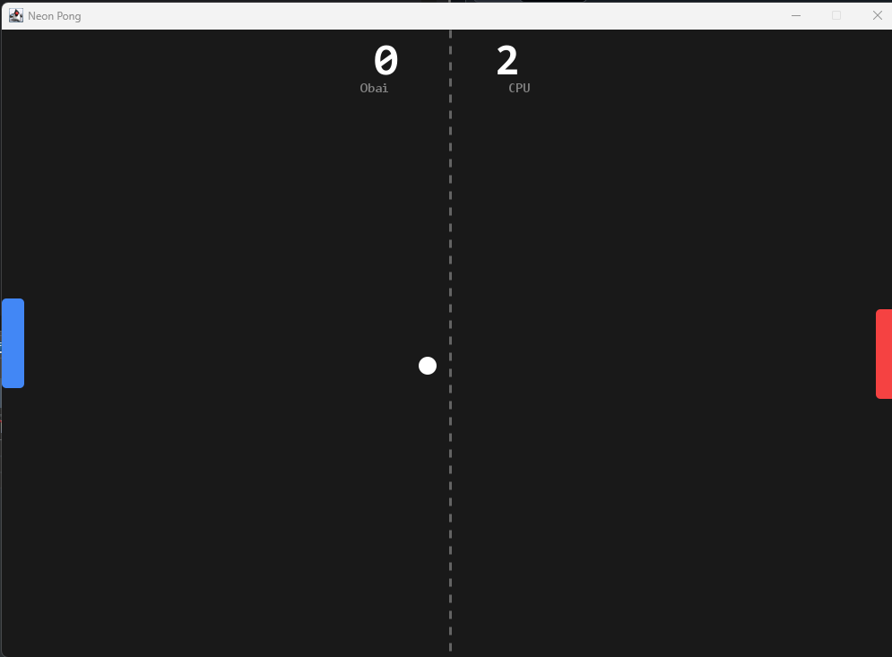

# 🏓 Neon Pong (Java)


Eine moderne Neuauflage des Arcade-Klassikers, entwickelt in Java.
Dieses Projekt zeichnet sich durch sauberen Code, eine verbesserte KI und ein modernes "Dark Neon" Design aus.

---

## 📸 Vorschau


---

## 🚀 Features

* **🎨 Neon UI:** Modernes Dark-Theme mit geglätteten Kanten (Anti-Aliasing) und gestrichelter Mittellinie.
* **⚡ Game Loop:** Eigene Implementierung eines stabilen Game-Loops (60 FPS) für flüssige Bewegungen.
* **🧠 Smart AI:** Der Computer-Gegner ("CPU") bewegt sich dynamisch zum Ball, anstatt zu springen.
* **physics:** Verbesserte Ballphysik mit Winkelberechnung beim Aufprall.

---

## 🎮 Steuerung

| Spieler | Tasten | Aktion |
| :--- | :---: | :--- |
| **(P1)** | `W` | Hoch |
| **(P1)** | `S` | Runter |
| **CPU** | *-* | Automatisch |

---

## 🛠️ Tech Stack

* **Sprache:** Java 21
* **Framework:** Java Swing / AWT
* **Struktur:** Objektorientiertes Design (OOP) mit getrennten Klassen für `Ball`, `Paddle` und `GamePanel`.

---

## 📦 Installation & Start

1.  **Repository klonen:**
    ```bash
    git clone [https://github.com/ObaiAlbek/pong_game.git](https://github.com/ObaiAlbek/pong_game.git)
    ```
2.  **Starten:**
    Öffne das Projekt in deiner IDE (Eclipse/IntelliJ) und starte die Datei `src/pong_game/Main.java`.

---
*Entwickelt von Obai Albek.*
